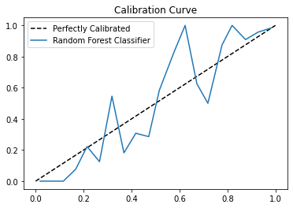

# calibra

Calibra is a python package for evaluating the calibration of machine learning models. It serves to help researchers and practitioners to evaluate the reliability of their models, by comparing expected and observed rates of occurence.

The calibration of a model is a measure of how reliable its predictions are. If a model predicts an outcome has an 80% probability of occurring, one would expect that outcome to occur approximately 80% of the time. Calibra can help users identify whether or not this is the case, by quantifying just how much the true rate of occurrence deviates from the expected rate of occurrence. This quantity can be measured in several different ways. We use the class-wise Expected Calibration Error (ECE) as described by [Kull et. al [1]](https://proceedings.neurips.cc/paper/2019/hash/8ca01ea920679a0fe3728441494041b9-Abstract.html).

In certain settings, modellers may be more interested in estimating the probability of certain outcomes, rather than simply predicting the most likely outcome, such as weather forecasting, diagnosis of disease, and sports betting. Under these circumstances, evaluating a model by its calibration may be more useful than evaluating it by accuracy alone.
    
Calibra provides a simple interface to allow users to calculate the model's class-wise expected calibration error, for any number of classes. It is highly compatible with scikit-learn and matplotlib.
To see how to use calibra, check out notebooks/examples.ipynb for a short tutorial. 


# Installation
## Dependencies
- Python (>=3.6)
- Pandas
- NumPy 
- Matplotlib

## User installation

To install calibra using pip, simply run:

`pip install calibra`

# Usage
The main use of calibra is the evaluation of the calibration of machine learning models. Users can easily calculate the class-wise ECE of a set of predictions, as shown below.

```
from calibra.errors import classwise_ece

y_pred_proba = [0.76, 0.85, 0.43, 0.95, 0.33, 0.12, 0.56, 0.45, 0.89, 0.82]
y_true = [1, 1, 1, 1, 0, 0, 0, 0, 1, 1]

expected_calibration_error = classwise_ece(y_pred_proba, y_true) 
``` 
The output below shows an error of 23.1%
```
0.23100000000000004
```

The class-wise ECE is given by the following equation: 

 

for the k-class problem with m bins. For each class, we weight each bin by the proportion of the dataset it contains, and get the absolute error between the expected and actual rate of occurrence (of instances of the given class) within each bin. We then sum these weighted deviations across all bins in the given class to get the error for that class, and get the average of these errors across all classes. 

By default the error is calculated for 20 bins of equal width, where the i_th bin is the interval [i/m, (i+1)/m), i.e. each interval includes its start boundary but not its end boundary, except for the final bin. These default values can be adjusted by changing the 'num_bins' and 'method' parameters.

Users can also visualise the calibration of their models by plotting calibration curves:

```
# y_pred_proba, y_true from RandomForestClassifier example in notebooks/examples.ipynb 

import matplotlib.pyplot as plt
from calibra.plotting import CalibrationCurve

calibration_curve = CalibrationCurve(y_pred_proba, y_true)
calibration_curve.plot(label='Random Forest Classifier')
plt.title('Calibration Curve')
plt.legend()
```



# Features

Calibra users can:
- Calculate the class-wise Expected Calibration Error (ECE) of a set of predictions, to quantify the reliability of the model
- Calculate this error on a class-by-class basis (useful if classes are of differing importance)
- Examine the distribution of the model's predictions by grouping these predictions into bins 
- Plot a calibration curve, to visualise the reliability of the model
- Color the calibration curve as a function of the bin weights, to reflect the density at each point along the curve.

# Examples/Demo
If you're interested in using calibra for your research or application, take a look at [notebooks/examples.ipynb](https://github.com/conorwalsh99/calibra/blob/main/notebooks/examples.ipynb) 

# License
Calibra is freely available under the [MIT License](https://github.com/conorwalsh99/calibra/blob/main/LICENSE)

# Citations
[1] [Kull, M., Perello Nieto, M., Kängsepp, M., Silva Filho, T., Song, H. and Flach, P., 2019. Beyond temperature scaling: Obtaining well-calibrated multi-class probabilities with dirichlet calibration. Advances in neural information processing systems, 32.](https://proceedings.neurips.cc/paper/2019/hash/8ca01ea920679a0fe3728441494041b9-Abstract.html)

# Contact Information
For all enquiries, email conorwalsh206@gmail.com 


